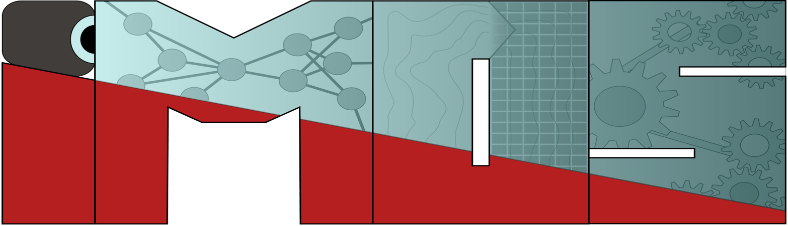

# IMC 2025 - Domain Adaptation Workshop

<p align="center">
    
    &nbsp;&nbsp;&nbsp;&nbsp;&nbsp;&nbsp;&nbsp;&nbsp;&nbsp;&nbsp;
    
</p>

This repository contains the code for the *Domain Adaptation* workshop held on 
September 1st, 2025 as part of the 9th Intelligent Maintenance Conference.

## 0 - Environment Setup

0. Clone this repository (or download it as a ZIP archive from GitHub and extract it):

```bash
git clone https://github.com/EPFL-IMOS/IMC2025_domain_adaptation.git
```

1. Install [uv](https://github.com/astral-sh/uv) using the 
[official instructions](https://github.com/astral-sh/uv?tab=readme-ov-file#installation).
We use `uv` to manage Python version and packages. ⚠️ **NOTE** ⚠️: if you cannot use
Powershell on your machine, you can download the x86_64 Windows installer from the
[Github release](https://github.com/astral-sh/uv/releases/tag/0.8.12). 🚨 **WARNING**: On
Windows make sure you open 64-bits Powershell terminals, and not 32-bits
~~Powershell(x86)~~ terminals.

```bash
# On macOS and Linux
curl -LsSf https://astral.sh/uv/install.sh | sh

# On Windows (MUST BE 64-bits Powershell)
powershell -ExecutionPolicy ByPass -c "irm https://astral.sh/uv/install.ps1 | iex"
```

2. Install Python 3.10 with `uv`:

```bash
uv python install 3.10
```

3. Navigate inside the cloned repository:
```bash
cd IMC2025_domain_adaptation
```

4. Install all the required packages automatically using `uv`:
```bash
uv sync
```

5. Activate the `python` virtual environment we just created. ⚠️ **NOTE** ⚠️: this must be ran
everytime you open a new terminal.
```bash
source .venv/bin/activate
``` 

6. Install [Visual Studio Code](https://code.visualstudio.com/). We will use it as our
development environment and code editor.

## 1 - Dataset Download

The datasets can be downloaded [here](https://drive.switch.ch/index.php/s/t8EsC0pBNbyxtqs).
Extract them at the root of the `IMC2025_domain_adaptation` directory. The folder structure
should look like this:

```
.
├── .venv
├── checkpoints/
├── datasets/
|   ├── gearbox/
|   ├── mnist_dataset/
│   └── N-CMAPSS_DS02.csv
├── notebooks/
├── .gitignore
├── LICENSE
├── pyproject.toml
├── README.md
└── uv.lock
```

## 99 - Organizers only

To re-create the official `uv` environment from scratch, use the following commands

```bash
# Install Python 3.10
uv python install 3.10

# Create imc2025 Python project
uv init imc2025

# Install PyTorch (must be 2.4.0 for PyTorch Geometric 2.6.1)
uv add torch==2.4.0 torchvision==0.19.0 torchaudio==2.4.0
uv add torch_geometric==2.6.1

# Install utility libraries
uv add tqdm pandas scipy seaborn matplotlib scikit_learn networkx tensorboard tensorboardX pyreadr neptune torchinfo gpustat yacs plotly ipykernel jupyter librosa h5py
```

Additional manual modifications to `pyproject.toml` are required to fully enable PyTorch Geometric:

1. Add the following to pyproject.toml to limit the project to macOS, Linux, and Windows

```toml
[tool.uv]
environments = [
    "sys_platform == 'darwin'",
    "sys_platform == 'linux'",
    "sys_platform == 'windows'",
]
```

2. Add the following to pyproject.toml to select the right pyg_lib version depending on the platform

```toml
[tool.uv.sources]
pyg_lib = [
  { url = "https://data.pyg.org/whl/torch-2.4.0%2Bcpu/pyg_lib-0.4.0%2Bpt24-cp310-cp310-macosx_14_0_universal2.whl", marker = "sys_platform == 'darwin'" },
  { url = "https://data.pyg.org/whl/torch-2.4.0%2Bcpu/pyg_lib-0.4.0%2Bpt24cpu-cp310-cp310-linux_x86_64.whl", marker = "sys_platform == 'linux'" },
  { url = "https://data.pyg.org/whl/torch-2.4.0%2Bcpu/pyg_lib-0.4.0%2Bpt24cpu-cp310-cp310-win_amd64.whl", marker = "sys_platform == 'windows'" },
]
```

3. Manually add `pyg_lib`, `torch-cluster`, `torch-scatter`, `torch-sparse`, and `torch-spline-conv` as dependency

```toml
dependencies = [
    ...,
    "pyg_lib==0.4.0",
    "torch-cluster>=1.6.3",
    "torch-scatter>=2.1.2",
    "torch-sparse>=0.6.18",
    "torch-spline-conv>=1.2.2",
    ...
]
```

4. Add the following to pyproject.toml to select the right `pyg_lib` version depending on the platform

```toml
[tool.uv.extra-build-dependencies]
torch-cluster = ["torch"]
torch-scatter = ["torch"]
torch-sparse = ["torch"]
torch-spline-conv = ["torch"]
```

5. Run `uv sync` to compile the `uv` environment.
